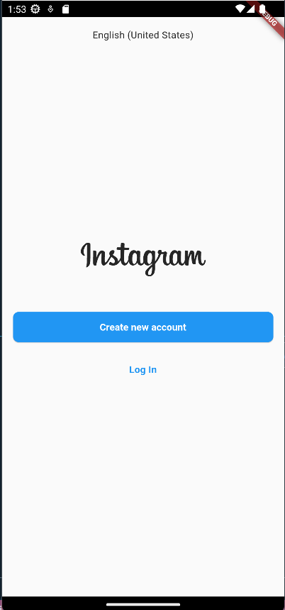
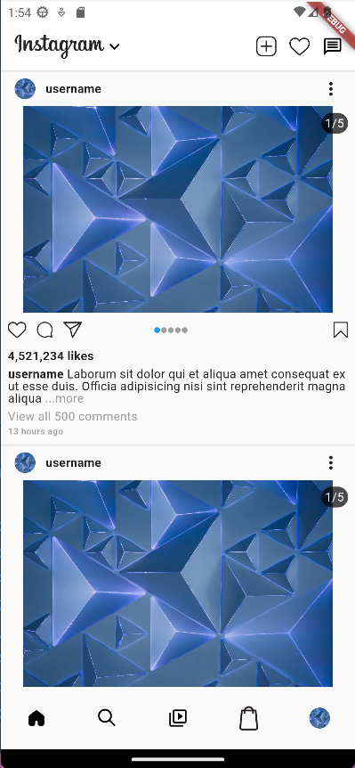

# Instagram Clone with Flutter

I am trying to clone [Instagram](https://www.instagram.com) apps with Flutter. This project is still on progress and will be updated later.

## Package that is used so far

-   [`auto_route`](https://pub.dev/packages/auto_route) - help navigate between screens
-   [`flutter_launcher_icons`](https://pub.dev/packages/flutter_launcher_icons) - help create launcher icon for the apps

## Result so far

